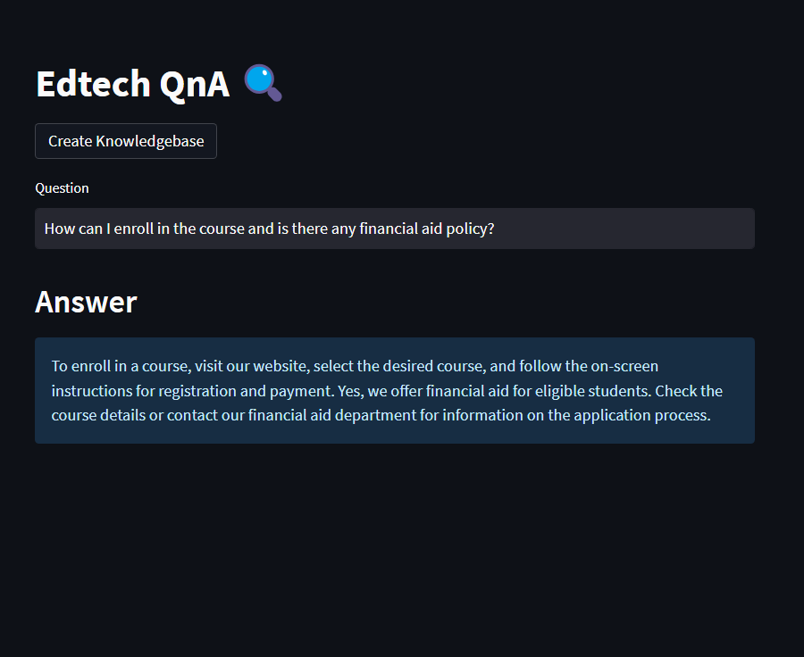

# Edtech - Question Answering Portal




## Project Overview
This is a QnA portal for Edtech industry developed using Langchain, Vector database and Streamlit where user can ask their queries and instead of waiting for the support team to reply, he can easily get his queries answered using the portal.

Here we've used Frequently asked questions as our knowledge base to answer those queries.

1. Clone this repo to your local using
```bash
git clone https://github.com/singh97kishan/Edtech-QnA-with-LLM.git
```

2. Navigate to Project directory using cmd/powershell
```bash
cd Edtech-QnA-with-LLM
```

3. Create a virtual Env
```bash
conda create -n <env_name> python=3.8.1 -y
``` 

4. Install all the required dependencies
```bash
pip install -r requirements.txt
```

> Please create a .env folder inside the directory and put your GOOGLE_API_KEY

```bash
GOOGLE_API_KEY= "your api key"
```

## Run the app

Run the Streamlit app -
```bash
streamlit run app.py
```
